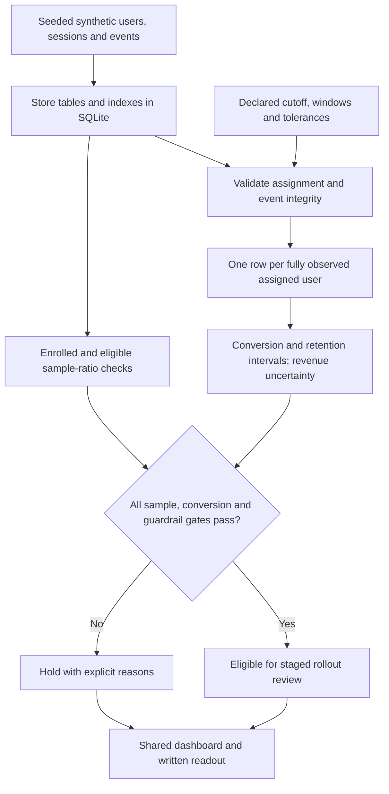

# Product Analytics Experimentation Lab: workflow

Use a synthetic product dataset to practice SQL metrics, funnel analysis, retention summaries and an experiment readout.

**Relevant roles:** data analyst, product data science.

## Flowchart

## Explain it in an interview

“I start with the product question and declare the observation windows and tolerated losses. SQL keeps inactive users in the denominator and excludes users who have not had enough follow-up. I then check assignment balance, conversion uncertainty and retention/revenue guardrails. A conversion gain can still produce a hold.”

## What this diagram does and does not establish

The dataset and stress scenarios are synthetic, so estimated lifts are not business outcomes. Retention is activity within a window, not exact-day retention. All gates are enforced, but policy values are illustrative and require advance agreement for a real experiment. Statistical intervals assume independent user assignment and a fixed analysis horizon; they do not correct for repeated peeking or severe revenue heavy tails.

## Follow the code

- [Synthetic tables and database](src/data_generator.py)
- [SQL metrics, retention and experiment test](src/analytics.py)
- [Report and recommendation logic](src/reporting.py)
- [Declared policy](config/experiment_policy.json)
- [Guardrail tests](tests/test_experiment_guardrails.py)
- [Conversion-positive scenarios that block rollout](outputs/guardrail_scenarios.md)
