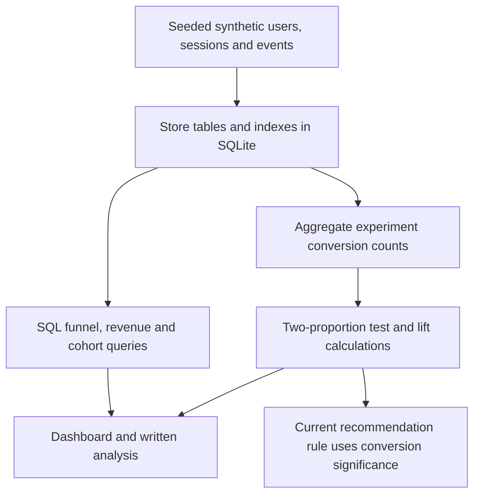

# Product Analytics Experimentation Lab: workflow

Use a synthetic product dataset to practice SQL metrics, funnel analysis, retention summaries and an experiment readout.

**Relevant roles:** data analyst, product data science.

## Flowchart

## Explain it in an interview

“I start with the product question and define the denominator before writing SQL. For a real experiment I would add sample-ratio checks, uncertainty intervals, observation windows and guardrails before recommending rollout.”

## What this diagram does and does not establish

The dataset is synthetic, so estimated lifts are not business outcomes. Retention uses activity-window summaries; check denominators and observation eligibility before using them as standard retention metrics. The current recommendation is based on conversion significance and does not enforce a retention guardrail.

## Follow the code

- [Synthetic tables and database](src/data_generator.py)
- [SQL metrics, retention and experiment test](src/analytics.py)
- [Report and recommendation logic](src/reporting.py)
